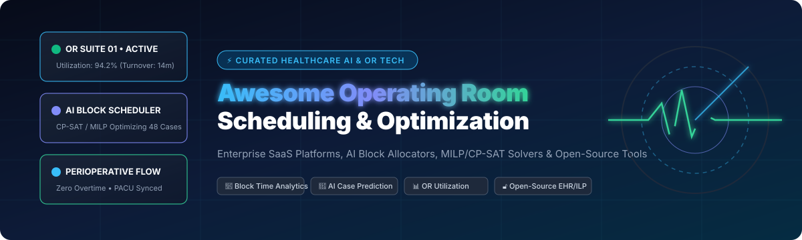
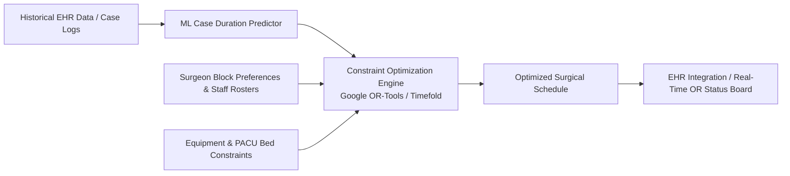

# 🏥 Awesome Operating Room Scheduling & Optimization

  

  
  
  
  
  
  
  

---

## ⚡ Overview & Ecosystem

A curated directory and reference index of **SaaS Platforms**, **AI Engines**, and **Open-Source Repositories** dedicated to **Operating Room (OR) Scheduling**, **Block Time Management**, **Surgical Case Sequencing**, **Perioperative Resource Allocation**, and **Hospital Capacity Optimization**.

Operating room suites represent up to **40% of hospital revenue and 30–40% of operating expenses**. Efficient surgical scheduling reduces idle room time, eliminates costly nurse overtime, minimizes patient wait times, and maximizes throughput for elective and emergency procedures.

---

## 📑 Table of Contents
- [🏢 SaaS / Commercial Platforms](#-saas--commercial-platforms)
- [🔓 Open-Source GitHub Repositories](#-open-source-github-repositories)
- [💡 Architectural Patterns & Frameworks](#-architectural-patterns--frameworks)
- [⭐ Star History](#-star-history)
- [🤝 How to Contribute](#-how-to-contribute)
- [⚖️ Disclaimer](#️-disclaimer)

---

## 🏢 SaaS / Commercial Platforms

> 📈 **Market Size & Sector Dynamics**: The global Operating Room Management and Surgical Scheduling Software market is valued at approximately **$3.5B – $4.7B** and projected to exceed **$11B – $15.4B by 2034–2035** at a **~12–16% CAGR**. The sector is **moderately fragmented with high tier-1 EHR concentration** (where foundational EHR giants like Oracle Health/Cerner, Epic, and MEDITECH dominate core institutional systems of record, while high-growth perioperative AI specialists like LeanTaaS, Qventus, and Caresyntax capture high-margin optimization overlays rather than an absolute single winner-take-all monopoly).

The commercial platforms below are **sorted in descending order by company valuation / market capitalization**:

| 🏷️ Platform | 📝 Description / Focus | 💰 Valuation / Company Size | 💳 Starting Pricing | 🎁 Free Tier / Free Trial Limits |
| :--- | :--- | :--- | :--- | :--- |
| **[Cerner SurgiNet (Oracle Health)](https://www.oracle.com/health/)** | Perioperative scheduling, intraoperative charting, and surgical supply management module within Oracle Health Millennium EHR. | **~$380B+ Market Cap** (Oracle Corp. Parent; ~$53B+ Annual Revenue) | Starting at **$25/user/month** (baseline EHR subscription module tier; ~$300/user/year) | **30-day Oracle Health Developer Sandbox trial**: Limited to synthetic EHR records and non-production API testing |
| **[Medtronic Touch Surgery](https://www.touchsurgery.com/)** | Digital surgical simulation, procedure training library, and enterprise surgical video analytics platform. | **~$115B+ Market Cap** (Medtronic plc; ~$32B+ Annual Revenue) | **$0/month** (Free mobile simulation app); Enterprise video analytics tier starts at **$800/month** (~$9,600/year) | **Free Forever Plan**: Unlimited access to 150+ surgical procedure simulations for 1 individual user (mobile app); **30-day Enterprise trial**: Limited to 5 clinician accounts and 10 uploaded surgical videos |
| **[Palantir Healthcare (Foundry)](https://www.palantir.com/platforms/foundry/)** | Enterprise data integration and operational AI platform for hospital-wide capacity management and surgical scheduling logistics. | **~$100B+ Market Cap** (Palantir Technologies; ~$2.8B+ Annual Revenue) | Starting at **$20,833/month** (~$250,000/year entry commercial enterprise contract tier) | **Free Forever Developer Tier**: 1 user, non-production learning environment (limited to standalone datasets); **30-day Enterprise trial** via cloud marketplace |
| **[Picis OR Manager](https://www.picis.com/)** | High-acuity surgical suite and perioperative management system supporting block scheduling, case tracking, and PACU documentation. | **~$60B+ Parent Market Cap** (Constellation Software / Harris Healthcare; ~$500M+ Healthcare Div. Revenue) | Starting at **$1,000/month** (~$12,000/year base platform fee for specialty surgical centers) | **14-day guided virtual trial**: Limited to pre-loaded demo surgical suites and clinical workflows |
| **[GE Healthcare Centricity / Opera](https://www.gehealthcare.com/)** | Enterprise perioperative documentation, case tracking, and surgical suite scheduling within GE Healthcare's clinical ecosystem. | **~$40B+ Market Cap** (GE HealthCare Technologies; ~$19.6B Annual Revenue) | Starting at **$1,800/month** (~$21,600/year baseline departmental software license tier) | **30-day staging evaluation trial**: Limited to 5 clinical user accounts on a hosted sandbox server |
| **[Epic OpTime](https://www.epic.com/)** | Comprehensive OR scheduling, preference card management, and surgical documentation module integrated into the Epic EHR platform. | **~$35B – $40B Est. Valuation** (Private; ~$4.9B+ Annual Revenue) | Starting at **$200/user/month** (via cloud/Community Connect arrangements; ~$2,400/user/year base module tier) | **30-day Epic Sandbox trial**: Limited to simulated patient data and non-production testing via UserWeb access |
| **[MEDITECH Expanse Surgery / OR](https://ehr.meditech.com/)** | Surgical scheduling, block allocation, and clinical documentation module within the MEDITECH Expanse hospital platform. | **~$1.5B+ Est. Valuation** (Private; ~$500M+ Annual Revenue) | Starting at **$500/month** (small clinic/single-provider tier; hospital tiers scale to ~$4,000–$12,000/month) | **30-day test environment trial**: Limited to 3 test provider seats with mock surgical cases |
| **[LeanTaaS iQueue for Operating Rooms](https://leantaas.com/)** | AI-driven OR scheduling and capacity optimization platform focused on block time analytics, predictive utilization, and throughput improvement. | **~$1.0B+ Unicorn Valuation** (Bain Capital backed; ~$100M+ ARR) | Starting at **$2,500/month** (~$30,000/year base deployment tier per hospital facility) | **30-day pilot trial**: Limited to 1 hospital facility / single perioperative department with historical EHR data evaluation |
| **[Hospital IQ](https://www.hospitaliq.com/)** | Predictive analytics and capacity management platform for perioperative flow, OR staffing, and inpatient capacity coordination. | **~$1.0B+ Valuation** (Part of LeanTaaS ecosystem / Bain Capital) | Starting at **$2,000/month** (~$24,000/year base capacity management tier for community hospitals) | **14-day interactive sandbox trial**: Limited to sample facility datasets and up to 3 user seats |
| **[Caresyntax](https://caresyntax.com/)** | Surgical intelligence platform combining OR IoT data, video capture, and perioperative workflow analytics for operational improvement. | **~$400M – $500M Est. Valuation** (Private VC-backed; ~$180M+ Total Funding) | Starting at **$1,200/month per OR suite** (~$14,400/year per connected operating room) | **30-day evaluation trial**: Limited to 1 demo OR suite integration / up to 10 recorded surgical cases |
| **[Health Catalyst Perioperative Analytics](https://www.healthcatalyst.com/)** | Data warehousing, OR turnover analytics, and surgical block utilization optimization platform. | **~$300M+ Market Cap** (NASDAQ: HCAT; ~$300M Annual Revenue) | Starting at **$3,500/month** (~$42,000/year base departmental analytics tier) | **30-day proof-of-value sandbox trial**: Limited to 1 surgical department / historical batch dataset analysis |
| **[Qventus](https://www.qventus.com/)** | Operations AI platform that optimizes OR schedules, automates outreach for open time, and improves surgical growth and workflow efficiency. | **~$200M – $250M Est. Valuation** (Private VC-backed; ~$110M+ Total Funding) | Starting at **$300/month** (small clinic/pilot tier; mid-size hospital tiers scale to ~$1,800–$5,000/month) | **30-day proof-of-concept trial**: Limited to 1 surgical service line / up to 5 operating room suites |
| **[AmkaiCharts (SIS Charts)](https://sisfirst.com/)** | Specialized Electronic Health Record and OR management software for Ambulatory Surgery Centers (ASCs) and surgical hospitals. | **~$200M+ Valuation** (Nordic Capital backed; ~$100M+ Revenue) | Starting at **$750/month** (~$9,000/year baseline ASC clinical documentation tier) | **14-day interactive evaluation trial**: Limited to 1 ASC facility instance and demo surgical dataset |
| **[Artisight](https://artisight.com/)** | Smart hospital IoT and AI sensor platform for automated surgical turnover tracking, virtual nursing, and OR capacity management. | **~$120M – $150M Est. Valuation** (Private VC-backed; ~$54M+ Total Funding) | Starting at **$1,000/month per OR suite** (all-inclusive hardware/software subscription tier) | **30-day workflow simulation trial**: Limited to 1 test room deployment with pre-installed sensor package |
| **[Apella](https://apella.io/)** | Computer vision and AI-powered surgical operations platform providing real-time room turnaround tracking and block scheduling analytics. | **~$50M – $80M Est. Valuation** (Private VC-backed; ~$25M+ Total Funding) | Starting at **$1,500/month per OR suite** (~$18,000/year per room including sensor package) | **30-day pilot trial**: Limited to 1–2 operating rooms with pre-configured sensor hardware kit |
| **[One Medical Passport](https://www.onemedicalpassport.com/)** | Cloud-based surgical pre-op readiness, patient engagement, and ASC case coordination platform. | **~$30M – $50M Est. Valuation** (Private; ~$10M+ Revenue) | Starting at **$500/month** (~$6,000/year baseline facility tier for ambulatory surgery centers) | **Free Forever Plan** for individual surgical patients (unlimited personal pre-op health history); **14-day facility trial** (limited to 25 test patient profiles) |
| **[Blockit OR](https://www.blockitnow.com/)** | Digital healthcare scheduling, surgeon referral coordination, and perioperative appointment access network. | **~$25M – $50M Est. Valuation** (Private VC-backed; ~$15M+ Total Funding) | Starting at **$145/month** (~$1,740/year for small practice tier; enterprise tiers start at ~$500/month) | **14-day free trial**: Full access for 1 user, limited to scheduling up to 50 test/live appointments |

---

## 🔓 Open-Source GitHub Repositories

The open-source repositories below provide algorithmic solvers, clinical EHR schedulers, and healthcare optimization engines. They are **sorted in descending order by GitHub Star count**:

1. **[google/or-tools](https://github.com/google/or-tools)**   
   🏆 *Google's Operations Research Tools* — State-of-the-art fast constraint programming (CP-SAT) and Mixed-Integer Linear Programming (MILP) solver suite used extensively to model OR room assignments, surgeon timetabling, and multi-resource surgical scheduling.

2. **[openemr/openemr](https://github.com/openemr/openemr)**   
   🏥 *ONC-Certified Open Source EHR & Medical Practice Management* — Feature-complete clinical management system with calendar booking and patient tracking that can be extended for surgical suite and procedure scheduling in clinics and ambulatory surgery centers.

3. **[TimefoldAI/timefold-solver](https://github.com/TimefoldAI/timefold-solver)**   
   🧠 *AI Constraint Solver Engine (Successor to OptaPlanner)* — Heavyweight optimization solver for complex healthcare planning, including surgical case scheduling, hospital bed allocation, and nurse/doctor roster balancing with hard and soft constraints.

4. **[medplum/medplum](https://github.com/medplum/medplum)**   
   🔥 *FHIR-First Healthcare Developer Platform* — Modern, developer-centric healthcare backend with complete FHIR Schedule, Slot, and Appointment API resources to build custom perioperative scheduling workflows and surgical portals.

5. **[HospitalRun/hospitalrun-frontend](https://github.com/HospitalRun/hospitalrun-frontend)**   
   🌐 *Free, Open Source Hospital Information System* — User-friendly modern React UI designed for hospital management and outpatient operations in resource-constrained environments, featuring clinical appointment and procedure scheduling.

6. **[coin-or/pulp](https://github.com/coin-or/pulp)**   
   🐍 *Python Linear Programming & Optimization Modeler* — Standard library for generating Mathematical Programming models (MILP/LP) to optimize operating room master surgical schedules (MSS) and block allocation policies.

7. **[tum-fml/doctor-scheduling](https://github.com/tum-fml/doctor-scheduling)**   
   👨‍⚕️ *Human-Centered Algorithmic Physician Scheduling* — Academic Constraint Programming models developed at Technical University of Munich for scheduling surgical and clinical staff while maximizing clinician preferences and compliance rules.

8. **[Operank/Operank-Scheduling](https://github.com/Operank/Operank-Scheduling)**   
   🎯 *Academic Surgery Scheduling with Machine Learning & CP-SAT* — Combines surgical duration prediction algorithms with constraint satisfaction solvers to maximize daily operating room utilization and minimize case cancellations.

9. **[arshc0der/Operation-Scheduler-For-Hospital-Management](https://github.com/arshc0der/Operation-Scheduler-For-Hospital-Management)**   
   📋 *Web-Based Surgical Operation Management Prototype* — Full-stack hospital management application for assigning doctors, reserving operating theaters, and detecting booking conflicts in real time.

10. **[pranavpatel08/Optimizing-Healthcare-Scheduling-Systems](https://github.com/pranavpatel08/Optimizing-Healthcare-Scheduling-Systems)**   
    📊 *Healthcare Scheduling & Patient Flow Optimization* — Applied graph algorithms, dynamic programming, and queuing theory to streamline clinical bottlenecks, reduce waiting times, and optimize theater resource allocation.

11. **[musicboy0322/Surgery-Scheduling-Website](https://github.com/musicboy0322/Surgery-Scheduling-Website)**   
    🗓️ *Visual Surgery Schedule Interface* — Interactive frontend dashboard for perioperative teams featuring drag-and-drop surgery rescheduling, surgeon room assignments, and visual timetable coordination.

---

## 💡 Architectural Patterns & Frameworks

### 🔬 Practical Implementation Guide:
1. **Core Optimization**: Leverage open-source constraint solvers like **[Google OR-Tools](https://github.com/google/or-tools)** (CP-SAT) or **[Timefold](https://github.com/TimefoldAI/timefold-solver)** to solve the Multi-Room Surgical Case Sequencing and Master Surgical Schedule (MSS) problem.
2. **Clinical System of Record**: Pair with standard FHIR resources (**[Medplum](https://github.com/medplum/medplum)**) or open EHRs (**[OpenEMR](https://github.com/openemr/openemr)**) to store appointments, surgeon credentials, and room availability.
3. **Machine Learning Pipeline**: Train gradient-boosted trees (e.g., XGBoost) or neural networks on historical anesthesia/incision logs to replace static surgeon duration estimates with predictive distributions.
4. **Real-Time Visibility**: Broadcast real-time milestones (Patient In Room, Wheels In, Incision, Wheels Out, Turnover Complete) to perioperative tracking boards to synchronize PACU, sterile processing, and anesthesia teams.

---

## ⭐ Star History

---

## 🤝 How to Contribute

Contributions are warmly welcomed! Please help expand this ecosystem with new SaaS products, research papers, and open-source optimization tools:

1. 🍴 **Fork** the repository.
2. 🌿 **Create a feature branch**: `git checkout -b add-new-or-tool`.
3. ✨ **Add the entry**: Follow the existing table/list structure with factual pricing, valuation, and GitHub stargazer badge links.
4. 🚀 **Submit a Pull Request** with a concise description of the addition.

---

## ⚖️ Disclaimer

- This is a **community-curated index** for educational, engineering, and research purposes.
- Operating room scheduling and surgical workflows directly impact clinical outcomes, patient safety, and healthcare operations.
- Open-source prototypes and research algorithms lack acute-care certification out-of-the-box. Any software influencing real-world surgical schedules must adhere to clinical validation, patient-safety governance, HIPAA/GDPR standards, and applicable medical device/health IT regulations.

---

  <b>Curated with ❤️ for surgeons, perioperative directors, operations researchers, and healthtech engineers.</b> 
  <i>Empowering surgical teams with data-driven scheduling, reduced turnover delays, and optimized OR capacity.</i>

